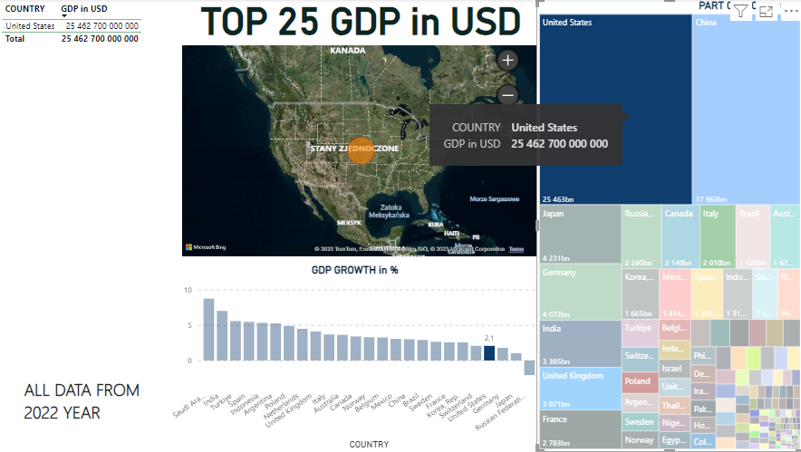
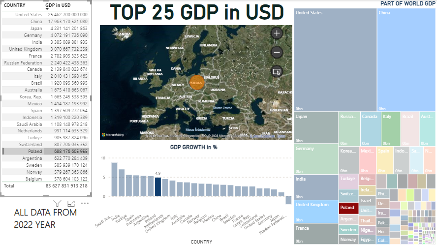
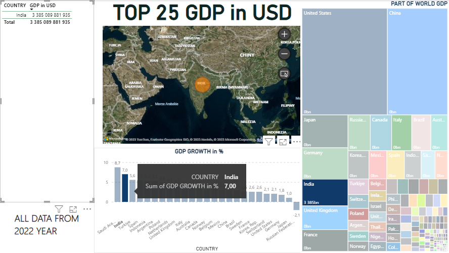

<h2>Wizualizacje danych PKB w Power BI / GDP data visualisations in Power BI </h2>
 
W tym repozytorium znajdują się wizualizacje danych w programie Power BI. Dostępny do pobrania jest główny plik projektowy oraz prezentacja graficzna w PDF.
Poniżej małe zobrazowanie funkcjonalności arkusz z wizualizacjami:

In this repository you can find data visualisations in Power BI. You can download lso Power BI project file and graphic presentation of dashboard in PDF file.
There is dashboard illustration below:

Informacje o rożnych wskaźnikach dotyczących PKB 25 największych gospodarek świata ukazane jako dodatkowa informacja do mapy świata:
 
Information about various GDP indicators of the world's 25 largest economies shown as additional information to the world map:

<picture>
 
</picture>
 
 
Diagram obrazujący wielkość PKB danego kraju względem PKB światowego:
 
Treemap shows the size of a given country's GDP relative to global GDP:

<picture>
 
</picture>
 
 
Wybór danych o państwie z tabeli będącej listą 25 największych gospodarek świata:
 
Selection of data about the country from the table which is a list of the 25 largest economies in the world:

<picture>
 
</picture>
 
 
Wykres kolumnowy z danymi o wzroście PKB w 2022 roku dla danego kraju wyrażony w procentach:
 
Column chart with GDP growth data in 2022 for a given country expressed as a percentage:

<picture>
 
</picture>
